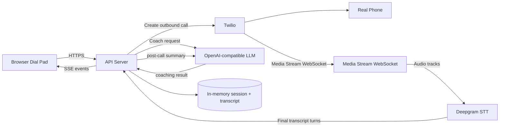
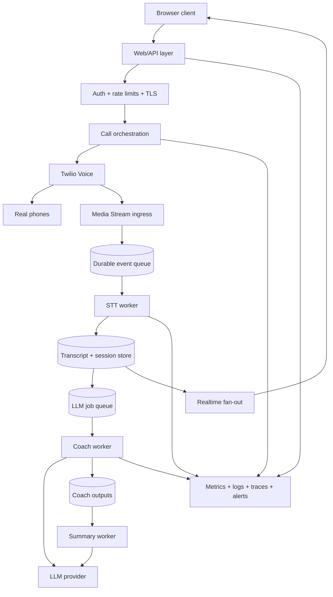

# System design

## 1. Current prototype

The current repository is a prototype for a real-estate AI sales coach. It contains a browser dial pad, an Express API server, Twilio outbound-call orchestration, Twilio Media Streams, Deepgram speech-to-text, transcript events over Server-Sent Events, and a Sales Coach LLM for live coaching and summary generation.

The actual implementation in this repository is:

- Browser UI in the mockup sandbox with a dial pad and a demo coach flow.
- Express API server in the artifacts API package handling the /api routes.
- Twilio outbound call creation and hang-up in the call route.
- Twilio Voice webhook handling in the voice and keypad routes.
- Twilio Media Stream WebSocket validation and Deepgram forwarding in the media stream service.
- Real-call session tracking in the real call session service.
- Sales coaching and post-call summary generation in the Sales Coach and summary service.
- Transcript SSE delivery in the call events route.
- Demo call flow and stage simulation in the dial pad and demo sequence components.

This is intentionally a prototype and keeps session state in memory on the API server.

## 2. Current architecture diagram

This matches the current code: the web UI receives transcript events and coaching updates from the API, while the server turns inbound and outbound Twilio audio into final transcript turns and then sends them to the LLM.

## 3. Production architecture

A production version would scale this in a few important ways. It would not rely on a single process holding all live session state, and it would use durable storage and asynchronous queues so that one slow LLM or STT provider does not block all calls.

### Production concerns

- Multiple calls need independent session isolation.
- Streaming audio and transcript traffic needs connection-aware broadcast.
- LLM processing should run asynchronously in a worker queue.
- Provider failures need retries, circuit breakers, and timeout budgets.
- Real transcript data should be stored durably with privacy controls.

## 4. Bottlenecks

| Bottleneck | Impact | Mitigation |
| --- | --- | --- |
| Single backend process | Session and websocket state are local to one process. Restarts lose live call data. | Move session state to durable storage and use multiple workers behind a load balancer. |
| WebSocket connections | Twilio Media Streams and browser SSE connections are sensitive to reconnects and load. | Use a dedicated realtime service or a queue-backed fan-out layer. |
| STT latency | Deepgram latency creates delayed transcript updates. | Enqueue work, use a separate STT worker, and monitor per-track latency. |
| LLM latency | Coach and summary calls can block user feedback if done synchronously. | Use background processing and optimistic UI states. |
| LLM cost | Long transcripts and frequent coach updates increase token spend. | Limit transcript windows, debounce updates, and add token budgets. |
| Provider rate limits | Calls can fail or get delayed when APIs are throttled. | Add retries, backoff, and queue-based concurrency limits. |
| Memory/session state | In-memory session maps are not resilient to failure or scale-out. | Persist sessions and transcript turns. |
| Transcript volume | High call volume produces large payloads and more downstream events. | Use chunking, summaries, and retention policies. |
| Frontend SSE connections | Browser clients can disconnect, reconnect, or overload the API. | Add reconnect logic and stable event streams per session. |
| Twilio limits | Trial accounts, phone restrictions, and rate caps may block real calls. | Enforce account validation and provide a demo mode for safe validation. |

## 5. Reliability

The current prototype assumes external services are available and mostly uses best-effort error handling. Production would need stronger failure isolation.

### Failure cases and expected handling

- Twilio fails to create a call: return a controlled API error and leave no stale session.
- Deepgram disconnects: close the connection, mark a transcription error, and allow the session to continue with degraded output if possible.
- LLM times out: return an unavailable coaching message without crashing the call.
- WebSocket disconnects: reconnect logic should rebind the browser or Twilio stream if the session is still active.
- Browser disconnects: the API should keep session state intact and continue coaching until the call ends or the session is cleaned up.
- Phone call ends unexpectedly: the session should be cleaned up and all transcript listeners closed.
- Duplicate transcript arrives: dedupe by session and transcript turn ID.
- Transcript arrives out of order: reorder by temporal sequence or keep a best-effort merge strategy.
- Provider rate limit occurs: queue job, retry with backoff, and surface a user-visible degraded state.

The production design should also require clear session termination and cleanup so that stale connections do not leak memory or produce phantom transcript updates.

## 6. Observability

Production needs metrics, logs, and tracing around every external dependency.

### Important metrics

- call_success_rate
- call_duration
- transcription_latency
- transcription_error_rate
- llm_latency
- coach_update_latency
- llm_error_rate
- websocket_disconnect_rate
- summary_success_rate
- provider_error_rate

### Logging and tracing

- Attach a callId, sessionId, streamSid, and turnId to every log event.
- Include Twilio and Deepgram provider response codes and request IDs where available.
- Log the reason when a connection is rejected or a session is cleaned up.
- Trace the full path from Twilio webhook to transcript event to LLM request to client update.

### Alerts

- Call creation failures spike
- Transcript latency rises over threshold
- Deepgram or LLM provider failures exceed a threshold
- WebSocket disconnect rate exceeds expected levels
- Summary generation failure rate increases

## 7. Data model

The production system would persist the following entities.

### Call
- id
- externalCallSid
- status
- mode
- createdAt
- endedAt
- agentId or tenantId

### Session
- id
- callId
- kind (real or demo)
- state
- conferenceName
- mode
- metadata (phone number, source)

### TranscriptTurn
- id
- sessionId
- speaker
- text
- source
- state
- confidence
- occurredAt
- callSid

### CoachRecommendation
- id
- sessionId
- stage
- sentiment
- nextBestMove
- objectionDetected
- urgency
- evidenceTurnIds
- createdAt

### CallSummary
- id
- sessionId
- conversationSummary
- customerPainPoints
- customerObjections
- customerNeeds
- keyCommitments
- recommendedNextStep
- followUpMessage
- overallSalesAssessment
- evidenceTurnIds
- createdAt

The key relationships are:

- One call has one session.
- One session has many transcript turns.
- One session has zero or many coach recommendations.
- One session has zero or one post-call summary.

## 8. Security

- Keep secrets in .env or a managed secret store; never in source control.
- Keep Twilio account and API keys and LLM keys outside the repo.
- Validate Twilio webhook signatures before accepting incoming requests.
- Use signed callback logic and verify the callback URL matches the configured public base URL.
- Encrypt transport and avoid unencrypted public endpoints.
- Apply least-privilege access for app credentials and service accounts.
- Keep transcript data private and restrict viewing by role.
- Be explicit about retention and deletion for call recordings, transcripts, and summaries.
- Minimize PII exposure in logs, traces, and analytics.

## 9. Scaling strategy

### 1 call
- Single process is enough.
- Session state can live in memory.
- Simple SSE and local LLM calls are sufficient.

### 10 calls
- Need isolated session state and better connection management.
- Add durable session tracking and queue-backed processing.
- Keep per-call dashboards and logs for debugging.

### 100 calls
- Horizontal scaling becomes necessary.
- Distribute API and worker nodes behind a load balancer.
- Move state to a shared store and make WebSocket fan-out session-aware.
- Use concurrency limits and queue priority for STT and LLM work.

### 1,000+ calls
- Add autoscaling for workers, provider-level retries, and observability pipelines.
- Separate ingestion, coaching, and summary workloads.
- Use sharded storage, retention limits, and per-tenant isolation.
- Introduce rate limiting, quotas, alerting, and cost controls.

## 10. What I would change first

| Priority | Change | Reason | Expected impact |
| --- | --- | --- | --- |
| 1 | Move session state to persistent storage | The current prototype is process-local and fails on restart | High reliability |
| 2 | Add a queue for LLM and STT jobs | Prevent provider latency from blocking the call flow | More stable calls |
| 3 | Add durable event bus / realtime fan-out | Better session scaling and reconnection safety | Better multi-call support |
| 4 | Add idempotency and retries for Twilio callbacks | Prevent duplicate transcripts and reprocessing | Better correctness |
| 5 | Add structured observability | Faster diagnosis of provider and connection failures | Operational clarity |

## 11. Trade-offs

The current architecture uses a direct Twilio-to-Deepgram-to-LLM pipeline because it is simple, understandable, and easy to validate. That simplicity is valuable for a prototype. The trade-off is that it is not production-safe: data is in memory, the API server is single-process, and scalability and durability are limited.

The chosen production evolution keeps the same essential flow but introduces durable storage, workers, and a shared realtime layer. That preserves the call architecture without overengineering the first production step. The biggest engineering judgment is to keep the proof-of-concept path small and then add queueing, persistence, and multi-instance support only after the live call flow has been proven stable.

## Summary

The current prototype works as a focused proof of concept: browser dial pad → Twilio outbound call → Twilio Media Streams → Deepgram STT → transcript stream → live Sales Coach → post-call summary. The production evolution is not a rewrite, but a scale-out of the same core pipeline with better session storage, reliability, observability, and concurrency controls.
