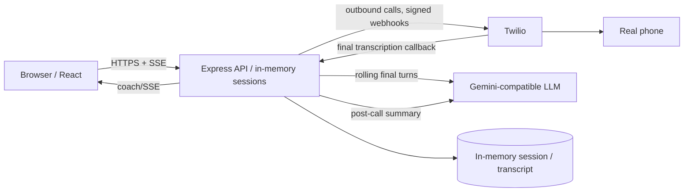
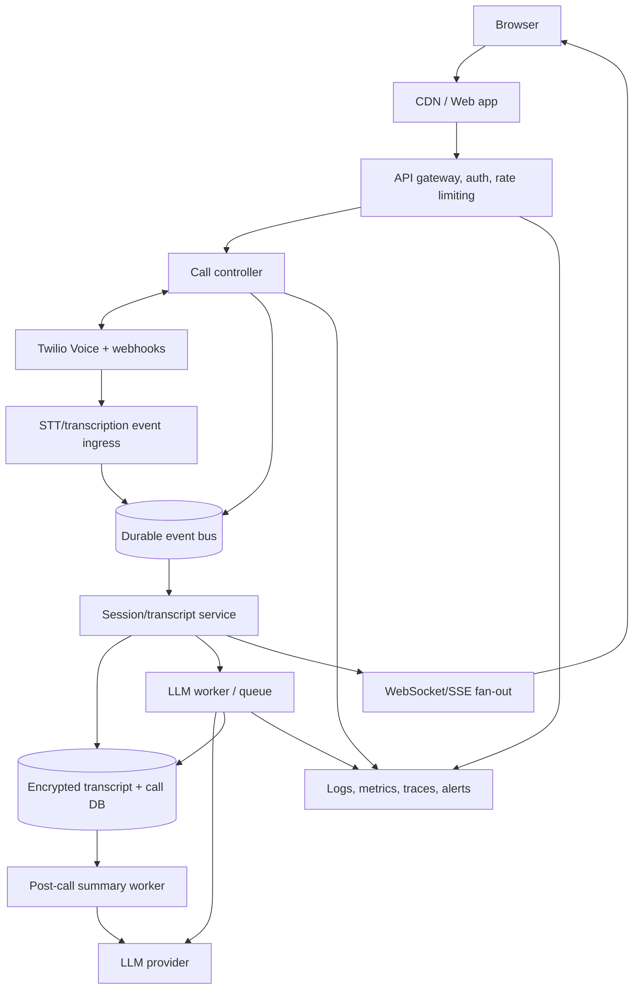

# Production system design

## Current prototype

The prototype is intentionally one-process: Maps hold sessions and SSE listeners, callback delivery is signed, and the browser directly requests coach and summary results. Its bottlenecks are process-local state, synchronous LLM latency, no durable transcript storage, and SSE connections bound to one API instance.

## Production architecture

## Scaling, reliability, and security

- Store sessions, idempotency keys, callback sequence IDs, and transcripts durably; partition by tenant/call.
- Acknowledge Twilio webhooks quickly, deduplicate by callback identity, and enqueue durable work. Retry transient work with bounded exponential backoff and dead-letter queues.
- Use a queue with per-tenant concurrency and backpressure for STT/LLM work. Stream ordered events by call; use Redis/pub-sub or a managed realtime service so WebSocket/SSE clients can reconnect to any instance.
- Cache static prompt/domain configuration, not private conversation output without a retention policy. Batch post-call work, set LLM timeouts/circuit breakers, and rate-limit tenant/request workloads for cost control.
- Use managed secrets, short-lived service credentials, TLS, least-privilege roles, encrypted data at rest, PII redaction, auditable retention/deletion, and tenant isolation.
- Measure webhook acceptance, callback lag, transcript/LLM latency, queue depth, coach failure rate, reconnects, cost per call, and summary completion. Correlate every request with call/session/trace IDs without logging raw secrets.

## First production changes

First replace in-memory sessions with durable storage plus an event bus. This removes data loss on restart, enables horizontal scaling, and gives webhook/LLM retries a correct idempotency boundary. Next move fan-out to shared realtime infrastructure and queue LLM requests so one slow model call cannot block other calls.
